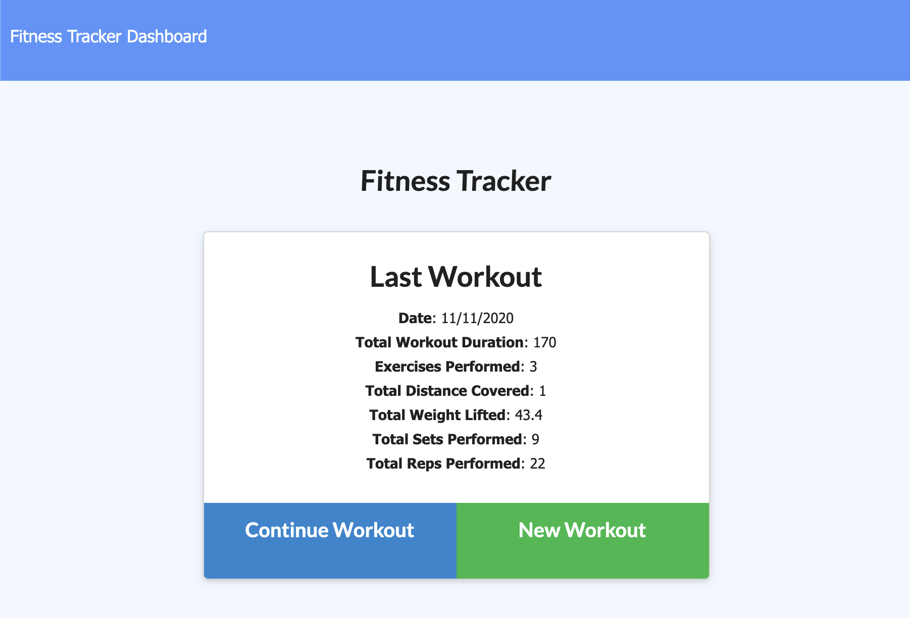
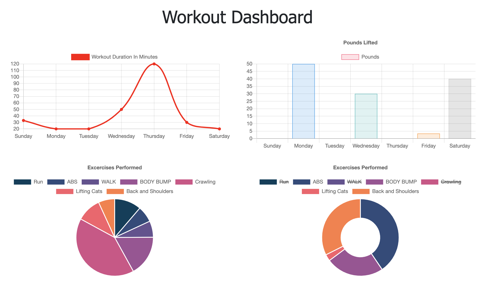

# workout-tracker

## Description
   The app will track your workout and provide statistics on the last 7 days based on the data entered. 

  ## Table of Contents:
  * [Techs](#Techs)
  * [Installation](#Installation)
  * [Usage](#usage)
  * [License](#license)
  * [Contributions](#contributions)
  
  ## Techs
  This app is built with Node.js, express, mongoose in the backend. Deployed on heroku using Mongodb Atlas. 

  ## Installation
  To run the app on your local computer you'll need to have MongoDB, Node.js installed. Download the project -> run npm i -> make sure mongodb is running -> in terminal run: npm start. 
  
  ## Usage
  First, start by adding your workout data.  
  You can continue adding exercises to the same workout or create a new workout.  
  Fill in the data required for each exercise.  
  Click on Dashboard to go to the statistics.
  
  ## Screenshots
  
  

  
  ## License
  None
  
  ## Contributions
  The following resources helped with building this app:  
  https://mongoosejs.com/docs/tutorials/virtuals.html  
  https://kb.objectrocket.com/mongo-db/how-to-use-the-mongoose-limit-function-927  
  https://mongoosejs.com/docs/queries.html
  
  
